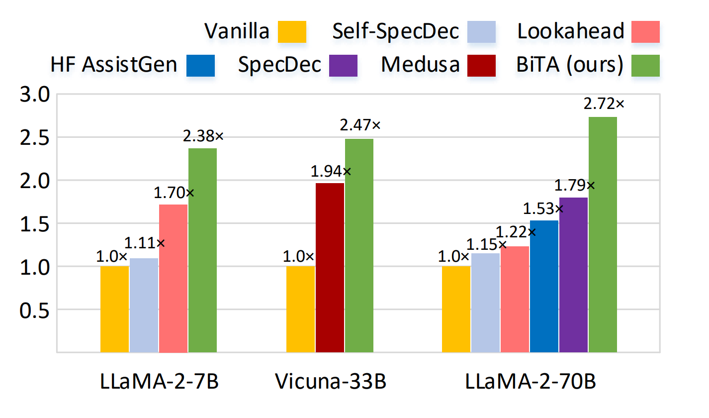

# BiTA: Bi-Directional Tuning for Lossless Acceleration in Large Language Models
This repository implements **Bi**-directional **T**uning for lossless **A**cceleration (**BiTA**), an innovative method expediting LLMs via streamlined semi-autoregressive generation and draft verification.

## Overview

<p align="left">  </p>

> [**BiTA: Bi-Directional Tuning for Lossless Acceleration in Large Language Models**](https://arxiv.org/abs/2401.12522),   
> Feng Lin, Hanling Yi, Hongbin Li, Yifan Yang, Xiaotian YU, Guangming Lu, Rong Xiao

## Setting Up Environment

- **Install Dependencies**
  ~~~
  pip install -r requirements.txt
  ~~~

- **Download the LLM Intended for Acceleration as Base Model**
  
  + *LLaMA-2* chat model series: [7B](https://huggingface.co/meta-llama/Llama-2-7b-chat-hf), [13B](https://huggingface.co/meta-llama/Llama-2-13b-chat-hf), [70B](https://huggingface.co/meta-llama/Llama-2-70b-chat-hf)
 
  + *Vicuna* series: [7B](https://huggingface.co/lmsys/vicuna-7b-v1.3), [13B](https://huggingface.co/lmsys/vicuna-13b-v1.3), [33B](https://huggingface.co/lmsys/vicuna-33b-v1.3)
 
  + *Falcon* series: [40B](https://huggingface.co/tiiuae/falcon-40b-instruct)

- **Create Symbolic Links from Source Base Models to the Checkpoint Directory**
  ~~~
  ln -s SOURCE_CHECKPOINT_PATH checkpoints/TARGET_CHECKPOINT_NAME
  ~~~

## Preparing Data

- **Training Datasets**
  
  We provide a small set of training samples for *LLaMA-2-7B-Chat* in this repository. The complete training data for *LLaMA-2-7B-Chat* can be found [here](https://).

  For experiments with other base models, such as ***Falcon***, additional preparation of training data is required.
  
  1. Start the *TGI* service for executing *Falcon* inference:
     ~~~
     text-generation-launcher --model-id checkpoints/falcon-40b-instruct-hf --trust-remote-code --max-input-length 2048 --max-total-tokens 4096 --sharded true --num-shard 8
     ~~~
     
  2. Generate *prompts*, also referred to as *queries* or *questions*, using the predefined *Falcon* templates:
     ~~~
     python3 test/gen_prompt.py --model_type falcon --output_path data/assembled_v2/falcon-40b/alpaca_lima_cip-50k_code_platypus_v2-prompt2.jsonl
     ~~~
     
  3. Generate *Falcon* outputs based on **greedy sampling**, forming *prompt-response* (*question-answer*) pairs as the training samples:
     ~~~
     # NUM_PROCESS denotes the number of processes executing simultaneously through TGI.
     # IP denotes the IP address providing the TGI service.
     python3 test/gen_llm_output.py data/assembled_v2/falcon-40b/alpaca_lima_cip-50k_code_platypus_v2-prompt2-output.jsonl data/assembled_v2/falcon-40b/tmp NUM_PROCESS IP
     ~~~
     
  4. Merge all *jsonl* files in directory ```data/assembled_v2/falcon-40b/tmp``` into one file ```alpaca_lima_cip-50k_code_platypus_v2-prompt2-output.jsonl``` and place it in directory ```data/assembled_v2/falcon-40b```.

- **Test Datasets**
  
  We offer the *MT-Bench* dataset in this repository, while other datasets for evaluation (*XSum*, *CIP-test*, and *HumanEval-X*) can be found [here](https://).
  

## Training

  We using *LLaMA-2-7B-Chat* as the base model for BiTA training in the example.

- **Single-Node**
  
  Run the script:
  ~~~
  sh scripts/run_sft-pt2_llama2-7b-chat.sh
  ~~~

- **Multi-Node**
  
  We employ the *DeepSpeed* library for multi-node training: (in our implementation, 32 *NVIDIA A800-80GB* GPUs are utilized)
  ~~~
  # remove any existing hostfile
  rm -rf hostfile
  # generate a new hostfile
  sh gen_openpai_hostfile.sh > hostfile
  # run the training script
  sh scripts/run_deepspeed_sft-pt2_llama2-70b-chat.sh
  ~~~
  
## Evaluation

  We provide scripts for both single-GPU testing and multi-GPU testing. The accelerated *LLaMA-2-7B-Chat* is evaluated using the following scripts. For other base models, simply adjust the path ```TEST_DIR``` and related hyperparameters (```MODEL_TYPE```, ```MASK_ID```, etc.) in the scripts.

- **Single-GPU**
  ~~~
  sh scripts/run_eval_mt-bench.sh
  ~~~

- **Multi-GPU**
  ~~~
  sh scripts/run_multigpu_eval_mt-bench.sh  
  ~~~

## Performance

  We present concise **speedup** results of model acceleration below; for more detailed results, please refer to [our paper](https://arxiv.org/abs/2401.12522).
  
  | Model &nbsp; &nbsp; &nbsp; &nbsp; &nbsp; &nbsp; &nbsp; &nbsp; | XSum &nbsp; &nbsp; &nbsp; &nbsp; &nbsp; &nbsp; | MT-Bench &nbsp; &nbsp; &nbsp; | CIP &nbsp; &nbsp; &nbsp; &nbsp; &nbsp; &nbsp; &nbsp; | HumanEval-X |
  |------------------------------------|------------|------------|------------|------------|
  | LLaMA-2-7B | 2.19 | 2.38 | 2.29 | 2.73 |
  | LLaMA-2-13B | 2.29 | 2.41 | 2.39 | 2.88 |
  | Vicuna-33B | 2.20 | 2.47 | 2.10 | 3.00 |
  | Falcon-40B | 2.28 | **2.75** | 2.32 | 3.07 |
  | LLaMA-2-70B | **2.55** | 2.72 | **2.58** | **3.31** |

## License

  This repository is licensed under the [Apache-2.0 License](LICENSE).

  Please follow the model licenses to use the corresponding model weights: [LLaMA-2](https://ai.meta.com/llama/license/) / [Vicuna](https://huggingface.co/lmsys/vicuna-7b-v1.3) / [Falcon](LICENSE)

## Citation

  If you find this project useful in your research, please kindly cite:

  ```bibtex
  @article{lin2024bita,
    title={BiTA: Bi-Directional Tuning for Lossless Acceleration in Large Language Models},
    author={Lin, Feng and Yi, Hanling and Li, Hongbin and Yang, Yifan and Yu, Xiaotian and Lu, Guangming and Xiao, Rong},
    journal={arXiv preprint arXiv:2401.12522},
    year={2024}
  }
  ```

## Acknowledgement

  This repository greatly benefits from [LLaMA-Factory](https://github.com/hiyouga/LLaMA-Factory). We extend our gratitude for their outstanding contributions.

## Contact

  Please feel free to reach out if you have any questions! Email: [lin1993@mail.ustc.edu.cn](mailto:lin1993@mail.ustc.edu.cn)
